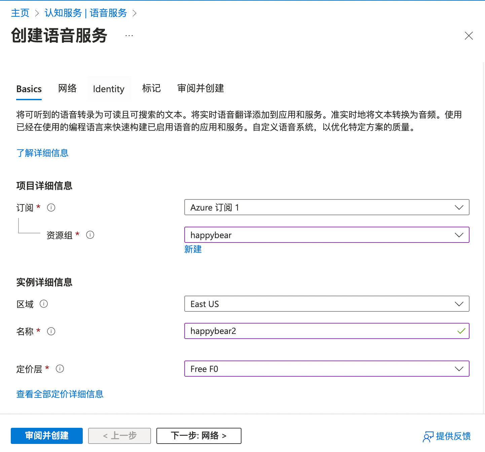
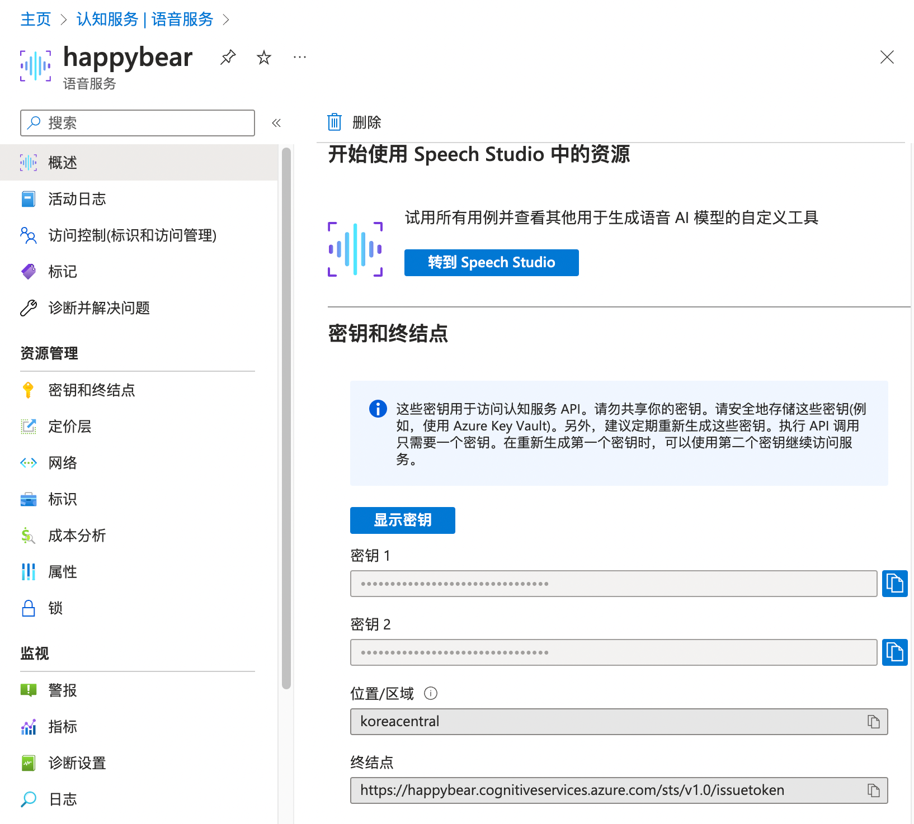

# 帮助文档
# Help document

HappyBear，这是一个由AI驱动的语音对话练习应用！

主要功能：
- 语音对话练习：随时与AI进行语音对话练习，提升你的口语技能。
- 单词卡片记录：使用单词卡片记录功能，更好地记住对话中的新词汇。
- 对话归档重放：通过归档和重播你的语音对话，不仅可以提升你的听力，更能提升你的口语技能。

HappyBear, this is an AI-driven voice chat application!

Main features:
- Voice Chat: Chat with AI at any time to improve your speaking skills.
- Word Card: Use the Word Card feature to better remember new vocabulary from the chat.
- Chat Replay: Archive and replay your voice chats. This feature can not only enhance your listening skills but also improve your speaking abilities.

## 设置 / Settings

### API KEY

1. openai api key，打开链接 https://platform.openai.com/account/api-keys 创建key
2. 复制粘贴到 api key ，点击 "校验"，校验通过后，出现绿色✅，表示可以使用。

**注：** 需要科学上网，并且有注册openai账号

### 自定义API域名
> 针对网络问题，自行搭建的服务，可以自定义域名，以便于在不同网络环境下使用。

## 微软语音 / Microsoft Azure

### 在 Azure 创建资源
1. 登录您的 Azure 账号
2. 点击链接创建 TTS 资源 https://portal.azure.com/#create/Microsoft.CognitiveServicesSpeechServices

- 区域: 最好选择 East Asia
- 名称: 随便起一个名字
- 定价层：选择免费试用（Free F0）或者标准计费

3. 填写完毕后，点击「审阅并创建」
4. 点击「创建」
5. 创建成功后点击「转到资源」
### 配置HappyBear

1. 选择区域，跟注册时一致
2. 点击「密钥 1」后面的复制按钮，复制到 HappyBear 的 Token 校验
3. 校验成功后会在下方显示支持的声音列表
4. 试听后点击选中对应的语音
5. 进入聊天对话，ai即是当选中的语音

## 本地服务 / LocalServer
> 依赖HappyBearServer，需要自行搭建本地服务

HappyBearServer工程地址：https://github.com/boqodo/HappyBearServer

