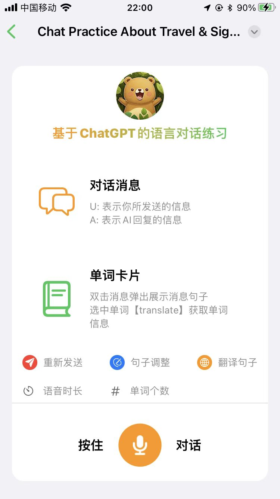
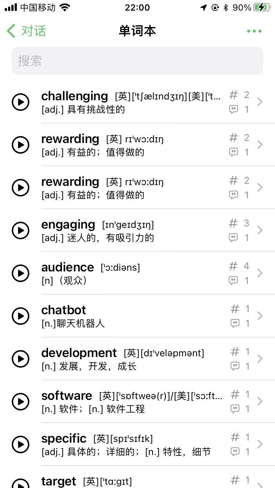
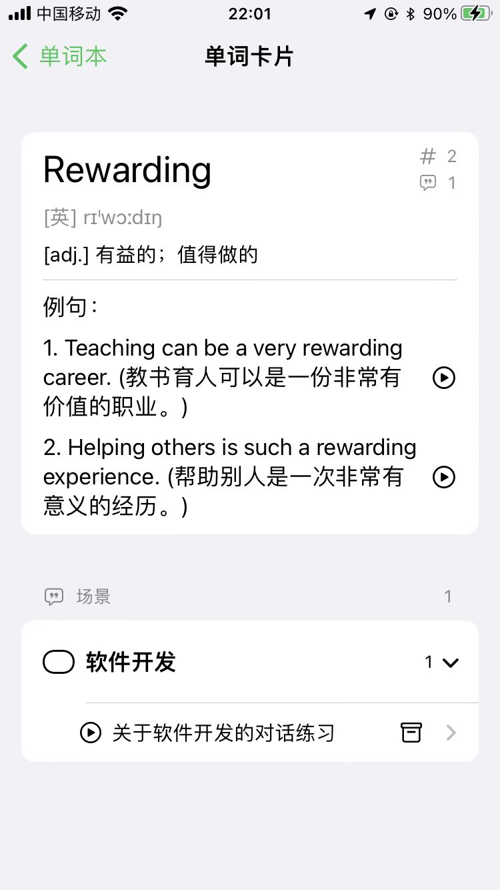
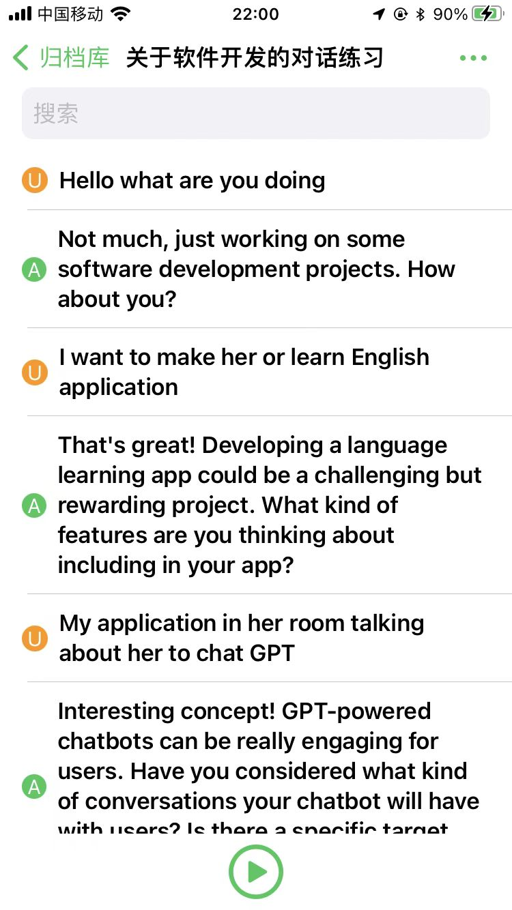

## HappyBear技术支持
## HappyBear technology support

### 欢迎使用“HappyBear”
### Welcome to "HappyBear"

HappyBear，这是一个由AI驱动的语音对话练习应用！

主要功能： 
- 语音对话练习：随时与AI进行语音对话练习，提升你的口语技能。 
- 单词卡片记录：使用单词卡片记录功能，更好地记住对话中的新词汇。 
- 对话归档重放：通过归档和重播你的语音对话，不仅可以提升你的听力，更能提升你的口语技能。

HappyBear, this is an AI-driven voice chat application!

Main features:
- Voice Chat: Chat with AI at any time to improve your speaking skills.
- Word Card: Use the Word Card feature to better remember new vocabulary from the chat.
- Chat Replay: Archive and replay your voice chats. This feature can not only enhance your listening skills but also improve your speaking abilities.

如果您在使用“HappyBear”的过程中遇到了问题您可以查阅完整的[帮助文档](./Help.md)。

If you run into problems using "HappyBear", you can consult the complete [help documentation](./Help.md)。

这里还提供有[使用条款](./Terms%20&%20Conditions.md)和[隐私政策](./Privacypolicy.md)供大家查阅。

The [Terms & Conditions](./Terms%20&%20Conditions.md) and [Privacy policy](./Privacypolicy.md) are also available here.

如果您还有问题，可以通过一下方式联系开发人员：

If you still have questions, you can contact the developer in the following ways:

邮箱/Email： mail@asugar.app

### 效果展示 / Effect display

1、首页效果 / Home page effect

2、语音对话练习 / Voice Chat

3、单词卡片记录 / Word Card

4、对话归档重放 / Chat Replay

